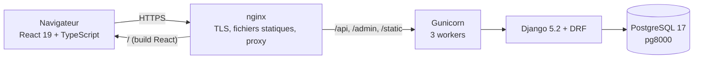
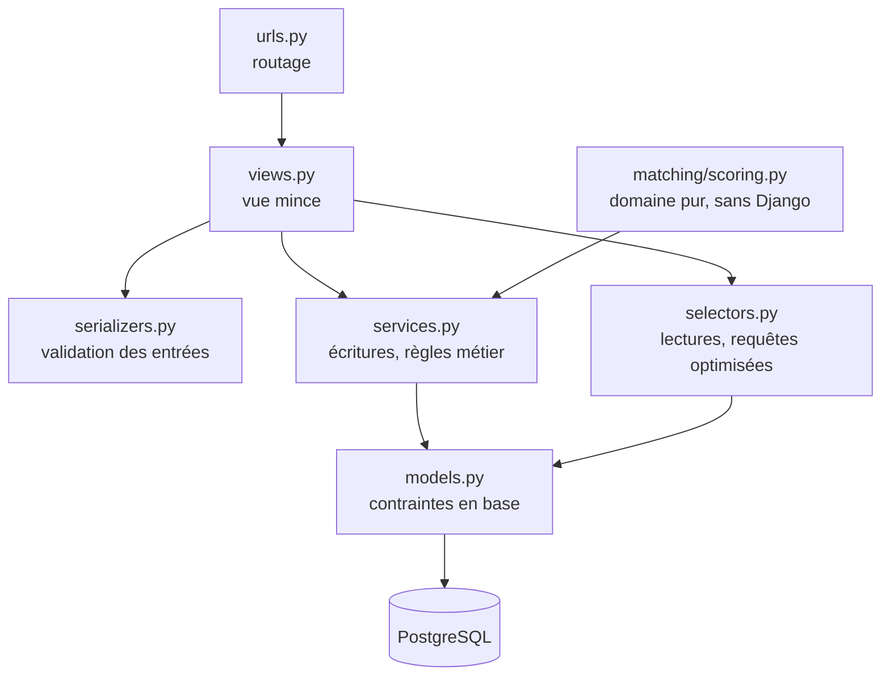
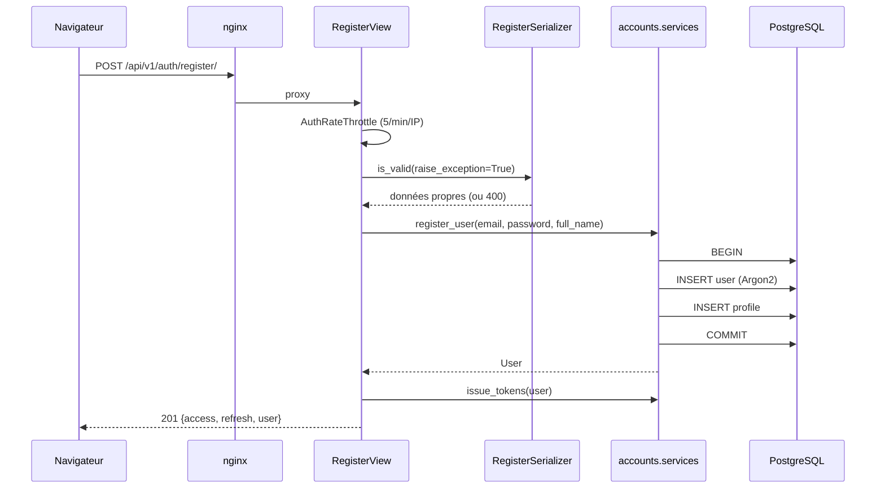
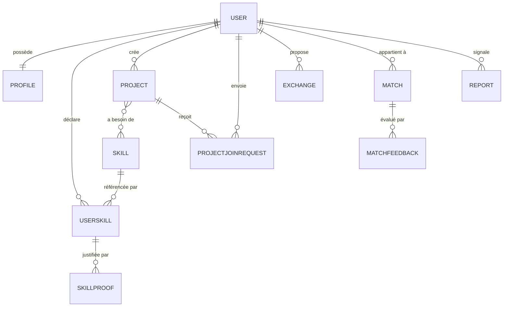

# Architecture de DevLink Africa

Document de référence pour l'équipe et pour l'oral devant le jury. Il décrit les couches, le chemin d'une requête, le modèle de données et l'algorithme de Dev Match.

## 1. Vue d'ensemble



## 2. Couches du backend

La règle est simple : **la logique métier ne vit jamais dans une vue ni dans un sérialiseur.**



| Fichier | Rôle | Ce qui est interdit |
|---|---|---|
| `views.py` | Valider l'entrée, appeler un service ou un sélecteur, renvoyer la réponse | Toute règle métier, tout accès direct à l'ORM |
| `serializers.py` | Forme et validité des données | Écriture en base, calculs métier |
| `services.py` | Écritures, transactions, règles | Connaissance du HTTP |
| `selectors.py` | Lectures optimisées (`select_related`, `prefetch_related`) | Écriture |
| `scoring.py` | Calcul du score | Tout import de Django |

### Pourquoi ce découpage

Il rend le code testable sans passer par HTTP, et il permet d'expliquer chaque règle à l'oral en montrant **une** fonction. C'est aussi ce qui garantit que le moteur de matching reste vérifiable : c'est une fonction pure, sans base de données.

## 3. Chemin d'une requête

Exemple : un visiteur crée son compte.



En cas d'erreur, le gestionnaire unique `core.exceptions.api_exception_handler` met toute réponse au même format :

```json
{ "detail": "…", "code": "…", "errors": { "champ": ["…"] } }
```

## 4. Modèle de données



### Choix structurants

- **`User` identifié par l'e-mail**, sans nom d'utilisateur. Modèle personnalisé créé avant la première migration, ce qui évite une migration douloureuse plus tard.
- **`Match` : `user_a` < `user_b`**, imposé par une `CheckConstraint` en base, plus une contrainte d'unicité sur la paire. Une même paire ne peut donc pas être stockée deux fois dans les deux sens.
- **`JSONField` plutôt qu'`ArrayField`** pour `availability`, `domains` et `explanation`. Les modèles restent portables entre PostgreSQL et SQLite.
- **Contraintes en base, pas seulement dans le code** : unicité de (utilisateur, compétence, type), d'une demande par paire, d'un retour par match et par auteur.

## 5. Dev Match : l'algorithme expliqué

Le moteur vit dans `backend/matching/scoring.py`. C'est du Python pur : aucune importation de Django, donc il se teste directement.

### Les poids

| Critère | Poids | Ce qu'il mesure |
|---|---|---|
| Complémentarité | 35 % | Ce que A sait et que B veut apprendre |
| Réciprocité | 20 % | L'échange va-t-il dans les deux sens ? |
| Envie de collaborer | 15 % | Disponibilités compatibles |
| Technologies communes | 10 % | Une base technique partagée |
| Disponibilité | 10 % | Présence de créneaux déclarés |
| Domaine | 10 % | Même domaine d'activité |

Ces poids vivent dans une constante documentée. **Toute modification de l'algorithme met à jour les tests et ce document.**

### Exemple chiffré

Ada sait TypeScript (intermédiaire) et Docker, veut apprendre Python. Kofi sait Python (avancé) et Docker, veut apprendre TypeScript. Tous deux sont disponibles pour du mentorat, tous deux dans le domaine WEB.

| Critère | Calcul | Points |
|---|---|---|
| Complémentarité | Kofi → Python pour Ada ; Ada → TypeScript pour Kofi : 2 correspondances sur 2 souhaits | 31,5 / 35 |
| Réciprocité | L'échange va dans les deux sens | 20 / 20 |
| Envie de collaborer | Mentorat des deux côtés | 11 / 15 |
| Technologies communes | Docker en commun | 10 / 10 |
| Disponibilité | Créneaux déclarés de part et d'autre | 5 / 10 |
| Domaine | WEB des deux côtés | 5 / 10 |
| **Score** | | **82,5 / 100** |

### Le point important pour le jury

**Un match à sens unique est plafonné.** Si Kofi peut apprendre à Ada mais qu'Ada n'a rien à lui offrir, le critère de réciprocité tombe à zéro, et le score reste bas. Le produit propose des échanges, pas du service à sens unique.

Le score est borné entre 0 et 100, et la somme des points de la répartition est égale au score : l'explication affichée dans l'interface est donc vérifiable par l'utilisateur.

### Recalcul incrémental

Les matchs ne sont pas recalculés à chaque lecture. Le recalcul a lieu à l'inscription et à chaque changement de compétences, et seulement pour les paires concernées par l'utilisateur modifié. Les transactions restent courtes.

## 6. Organisation du frontend

```
frontend/src/
  app/              routeur, AuthProvider, garde de routes, mise en page
  features/<nom>/   api/ components/ hooks/ pages/   (auth, profile, skills, matches, …)
  components/ui/    Button, Field, Card, Badge, Skeleton, EmptyState, ErrorState, Spinner
  lib/              client d'API typé, types du contrat, jetons, utilitaires
  pages/            écrans encore à implémenter (un ticket chacun)
```

### Règles

- **TypeScript strict, aucun `any`.** Les types des réponses sont centralisés dans `lib/types.ts` et suivent `docs/api.md`.
- **Quatre états par écran** : chargement (squelettes), vide (avec une action), erreur (avec réessai), succès. Les composants correspondants sont dans `components/ui/`.
- **Un seul point d'accès au réseau** : `lib/api.ts`. Il ajoute le jeton, renouvelle l'accès expiré une fois, puis rejoue la requête, et convertit toute erreur en `ApiError` porteuse des erreurs par champ.
- **Accessibilité** : labels liés aux champs, `aria-invalid` et `aria-describedby` sur les erreurs, focus visible, lien d'évitement, `eslint-plugin-jsx-a11y` sans avertissement.

## 7. Sécurité en bref

Voir `docs/securite.md` pour le détail. Les points structurants : Argon2, jetons d'accès courts avec liste noire du rafraîchissement à la déconnexion, throttling strict sur `/auth/*`, refus des champs non déclarés, aucun SQL concaténé, et `404` plutôt que `403` sur les ressources d'autrui pour ne pas confirmer leur existence.
